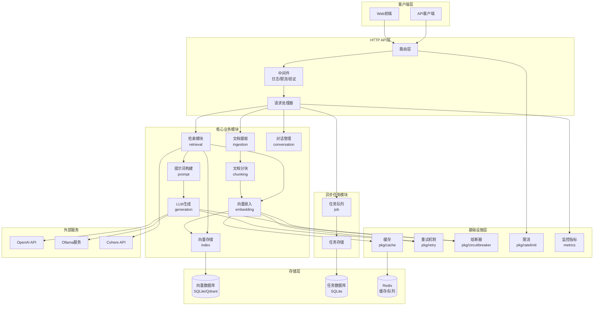
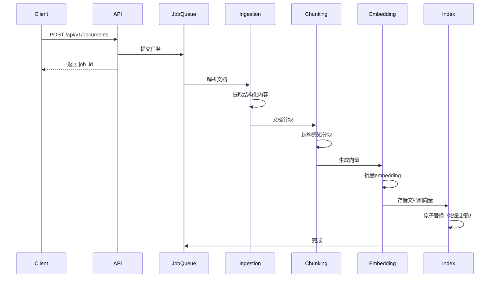
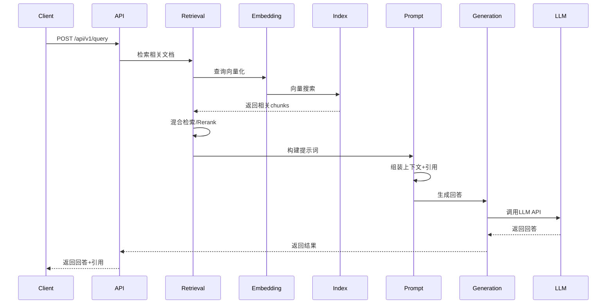
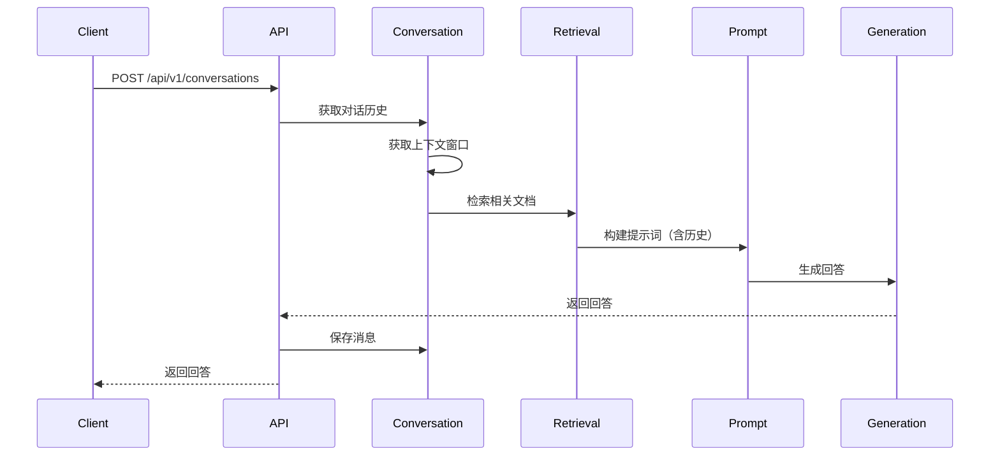
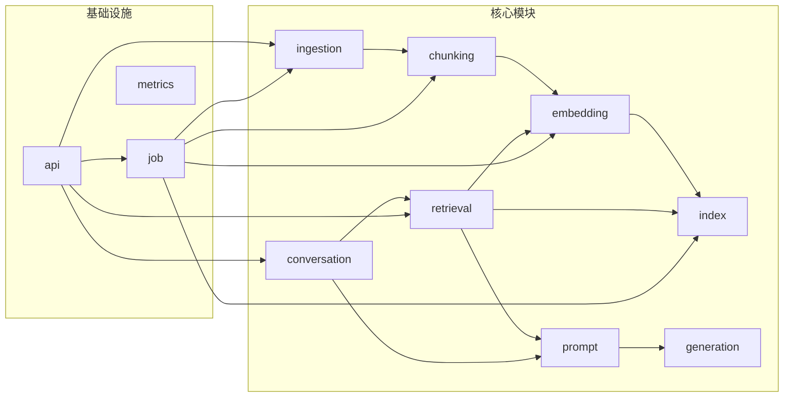
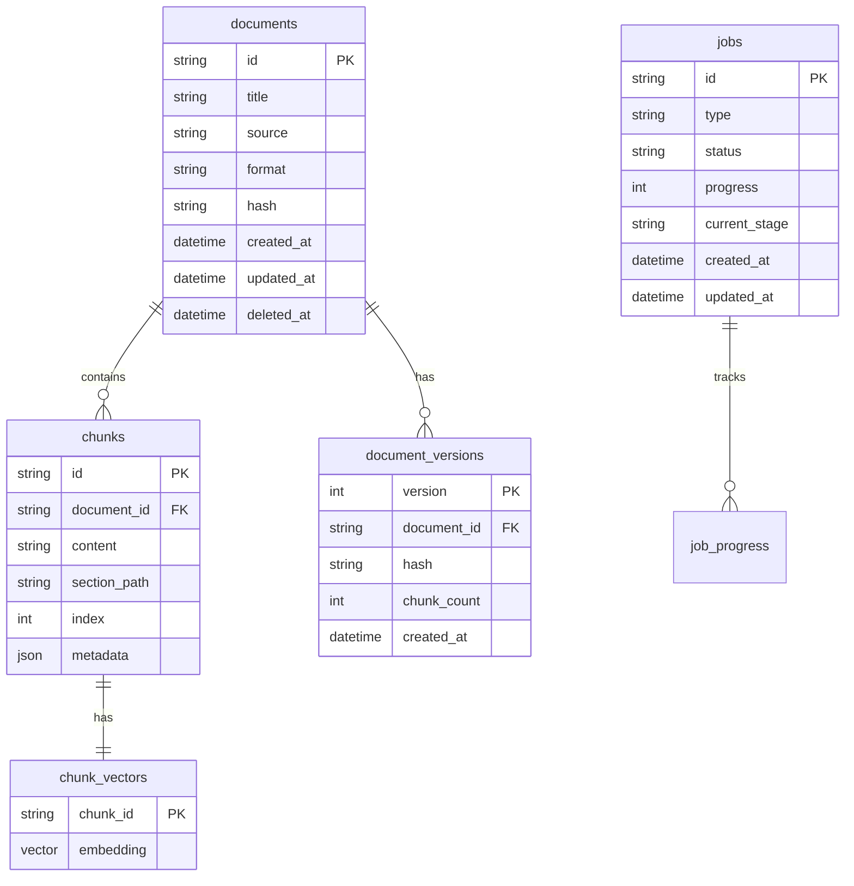
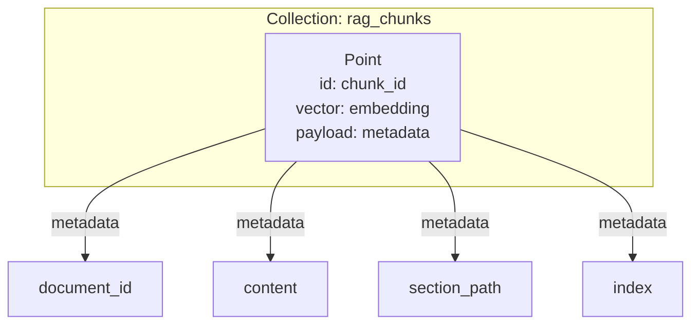
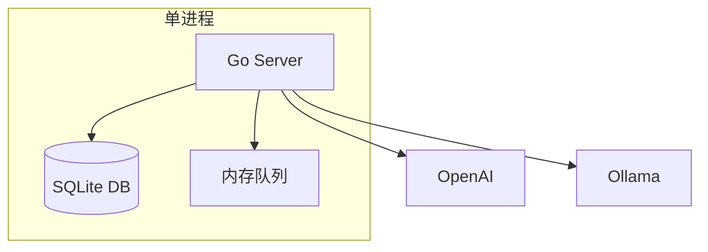
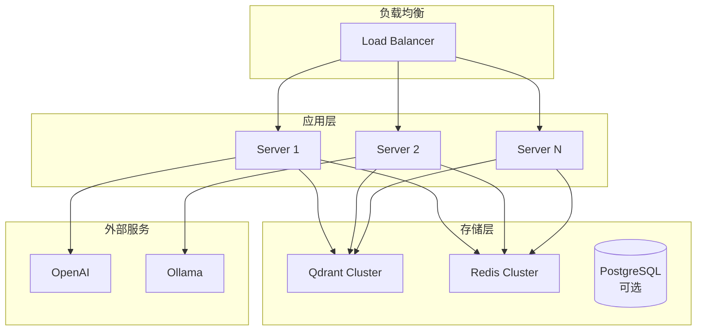

# 系统架构文档

## 系统概览

本系统是一个生产级的 Go RAG (Retrieval-Augmented Generation) 知识库系统，采用模块化设计，支持多 Provider、异步处理、版本控制等高级功能。

## 整体架构图

## 数据流图

### 文档摄取流程

### 查询流程

### 对话流程

## 模块依赖关系

## 存储架构

### SQLite 存储结构

### Qdrant 存储结构

## 部署架构

### 单机部署

### 分布式部署

## 技术栈

### 后端

- **语言**: Go 1.21+
- **Web框架**: go-chi/chi
- **数据库**: SQLite + sqlite-vec / Qdrant
- **缓存**: Redis (可选)
- **任务队列**: 内存队列 / Redis (asynq)
- **日志**: zap
- **配置**: viper

### 外部服务

- **LLM**: OpenAI, Anthropic, Ollama, Kimi
- **Embedding**: OpenAI, Ollama
- **Reranker**: Cohere

### 监控

- **Metrics**: Prometheus
- **健康检查**: 内置健康检查端点

## 设计模式

### 1. 注册表模式 (Registry Pattern)

用于管理多个 Provider：
- `ParserRegistry`: 文档解析器
- `EmbedderRegistry`: Embedding provider
- `LLMRegistry`: LLM provider

### 2. 策略模式 (Strategy Pattern)

用于可替换的算法：
- 分块策略（结构感知、语义分块）
- 检索策略（向量、BM25、混合）
- 融合策略（RRF、Average、Max）

### 3. 适配器模式 (Adapter Pattern)

用于接口适配：
- `VectorStore` 接口的多种实现（SQLite、Qdrant）
- `Cache` 接口的多种实现（内存、Redis）

### 4. Worker Pool 模式

用于并发处理：
- 任务队列的 Worker Pool
- 并发安全的资源访问

## 扩展点

### 1. 新文档格式

实现 `Parser` 接口并注册到 `ParserRegistry`

### 2. 新存储后端

实现 `VectorStore` 接口

### 3. 新 LLM Provider

实现 `LLM` 接口并注册到 `LLMRegistry`

### 4. 新检索策略

实现 `Retriever` 接口

### 5. 新分块策略

实现 `Chunker` 接口

## 性能特性

- **异步处理**: 文档摄取异步化，不阻塞API
- **批量操作**: Embedding 和存储支持批量处理
- **缓存机制**: Embedding 和查询结果缓存
- **并发安全**: 所有模块支持并发访问
- **连接池**: HTTP 客户端连接复用

## 可靠性特性

- **重试机制**: 网络错误自动重试
- **熔断器**: 防止级联失败
- **限流**: API 限流保护
- **超时控制**: 所有外部调用都有超时
- **优雅关闭**: 支持优雅关闭和资源清理

