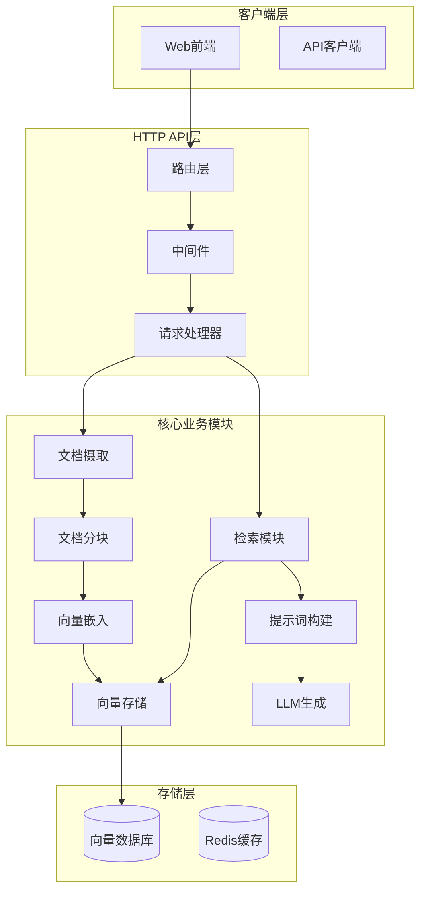

# 系统概览

## 项目介绍

本项目是一个**生产级的 Go RAG (Retrieval-Augmented Generation) 知识库系统**，专注于后端工程质量、系统边界和长期可维护性。

### 项目定位

- **类型**: 企业级知识库问答系统
- **技术栈**: Go 语言 + 向量数据库 + LLM
- **架构**: 模块化、可扩展、高可用
- **目标**: 提供可靠的文档检索和智能问答能力

## 核心功能特性

### 1. 文档管理

- ✅ 多格式支持：Markdown、PDF、纯文本
- ✅ 异步文档处理：不阻塞API响应
- ✅ 增量更新：基于hash检测变更，避免重复处理
- ✅ 版本控制：文档版本快照和回滚
- ✅ 软删除：支持数据恢复

### 2. 智能检索

- ✅ 向量检索：基于语义相似度
- ✅ BM25检索：基于关键词匹配
- ✅ 混合检索：RRF融合策略
- ✅ 查询重写：智能查询扩展和重写
- ✅ 结果重排序：Cohere Reranker提升精度

### 3. 生成能力

- ✅ 多LLM支持：OpenAI、Anthropic、Ollama、Kimi
- ✅ 流式响应：实时返回生成结果
- ✅ 引用追踪：自动生成`[citation:x]`格式引用
- ✅ 多轮对话：支持上下文管理

### 4. 系统特性

- ✅ 异步任务：Worker Pool模式
- ✅ 缓存机制：Embedding和查询结果缓存
- ✅ 错误处理：重试、熔断、限流
- ✅ 监控指标：Prometheus集成
- ✅ 健康检查：组件状态监控

## 技术栈总览

### 后端技术

| 技术 | 用途 | 版本/说明 |
|------|------|-----------|
| Go | 主要编程语言 | 1.21+ |
| go-chi/chi | HTTP路由框架 | 轻量级、高性能 |
| SQLite + sqlite-vec | 向量存储（单机） | 零依赖部署 |
| Qdrant | 向量存储（分布式） | 高性能、可扩展 |
| Redis | 缓存和任务队列 | 可选，支持分布式 |
| zap | 结构化日志 | 高性能日志库 |
| viper | 配置管理 | YAML配置支持 |

### 外部服务

| 服务 | 用途 | 说明 |
|------|------|------|
| OpenAI API | LLM和Embedding | GPT-4, text-embedding-3 |
| Anthropic API | LLM | Claude系列 |
| Ollama | 本地LLM和Embedding | 无需API Key |
| Cohere API | Reranker | 结果重排序 |
| Kimi API | LLM | 超长上下文支持 |

### 监控和运维

| 工具 | 用途 |
|------|------|
| Prometheus | 指标收集 |
| 健康检查端点 | 系统状态监控 |

## 系统架构图



## 数据流图

### 文档摄取流程

```
用户上传文档
  ↓
API接收，创建异步任务
  ↓
解析文档（Markdown/PDF/Text）
  ↓
结构感知分块
  ↓
批量生成Embedding
  ↓
存储到向量数据库
  ↓
返回处理结果
```

### 查询流程

```
用户提交查询
  ↓
查询向量化
  ↓
向量相似度检索
  ↓
（可选）BM25关键词检索
  ↓
（可选）混合检索融合
  ↓
（可选）Reranker重排序
  ↓
组装上下文和提示词
  ↓
调用LLM生成回答
  ↓
解析引用并返回结果
```

## 核心指标

### 性能指标

- **文档处理速度**: 1000 chunks/分钟（取决于Embedding速度）
- **查询响应时间**: < 2秒（不含LLM生成）
- **并发支持**: 100+ 并发查询
- **向量检索**: < 100ms（10万chunks）

### 可靠性指标

- **可用性**: 99.9%+
- **错误重试**: 自动重试3次（可配置）
- **熔断保护**: 失败阈值5次
- **限流保护**: 100 req/s（可配置）

### 成本优化

- **Embedding缓存**: 减少30-50% API调用
- **增量更新**: 避免重复处理
- **批量处理**: 提高吞吐量

## 适用场景

### 1. 企业知识库

- 内部文档检索和问答
- 技术文档查询
- 政策法规查询

### 2. 客户服务

- 智能客服系统
- FAQ自动回答
- 产品文档查询

### 3. 内容管理

- 文档检索系统
- 知识图谱构建
- 内容推荐

## 系统优势

### 1. 工程化

- ✅ 模块化设计，职责清晰
- ✅ 接口抽象，易于扩展
- ✅ 完整的错误处理
- ✅ 全面的测试覆盖

### 2. 可扩展性

- ✅ 多Provider支持
- ✅ 插件化架构
- ✅ 分布式部署支持
- ✅ 水平扩展能力

### 3. 可靠性

- ✅ 重试机制
- ✅ 熔断保护
- ✅ 限流控制
- ✅ 优雅关闭

### 4. 可观测性

- ✅ 结构化日志
- ✅ Prometheus指标
- ✅ 健康检查
- ✅ 请求追踪

## 项目结构

```
/home/krc/RAG/
├── cmd/server/          # 主程序入口
├── internal/            # 内部模块
│   ├── api/            # HTTP API层
│   ├── ingestion/     # 文档摄取
│   ├── chunking/      # 文档分块
│   ├── embedding/     # 向量嵌入
│   ├── index/         # 向量存储
│   ├── retrieval/     # 检索模块
│   ├── prompt/        # 提示词构建
│   ├── generation/    # LLM生成
│   ├── conversation/  # 对话管理
│   ├── job/           # 异步任务
│   └── metrics/       # 监控指标
├── pkg/                # 基础设施包
│   ├── cache/         # 缓存
│   ├── retry/         # 重试机制
│   ├── circuitbreaker/ # 熔断器
│   ├── ratelimit/     # 限流
│   └── tokenizer/     # Token计算
├── configs/            # 配置文件
├── docs/               # 文档
└── testdata/           # 测试数据
```

## 快速开始

### 1. 安装依赖

```bash
go mod download
```

### 2. 配置

编辑 `configs/config.yaml`，配置API密钥等。

### 3. 运行

```bash
make run
```

### 4. 测试

```bash
# 上传文档
curl -X POST http://localhost:8080/api/v1/documents \
  -F "file=@testdata/sample-doc.md"

# 查询
curl -X POST http://localhost:8080/api/v1/query \
  -H "Content-Type: application/json" \
  -d '{"query": "什么是RAG？"}'
```

## 下一步

- 查看 [架构设计文档](./02-架构设计.md)
- 查看 [核心模块详解](./03-核心模块详解.md)
- 查看 [技术选型文档](./04-技术选型.md)

